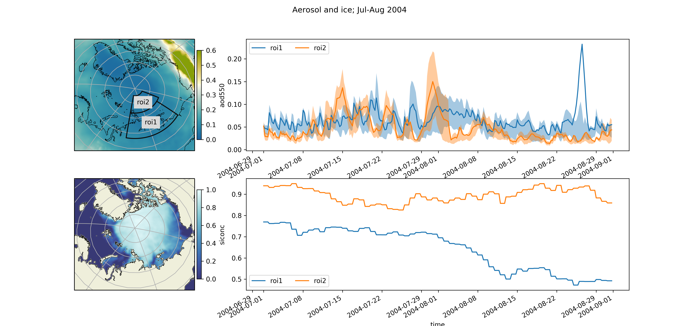

# cams_visu repository
## Visualizing tool for [CAMS](https://atmosphere.copernicus.eu/catalogue#/) data

## Purposes
A few python lines to help plot geospatial and timeseries from CAMS netcdf files.

##Examples

 
